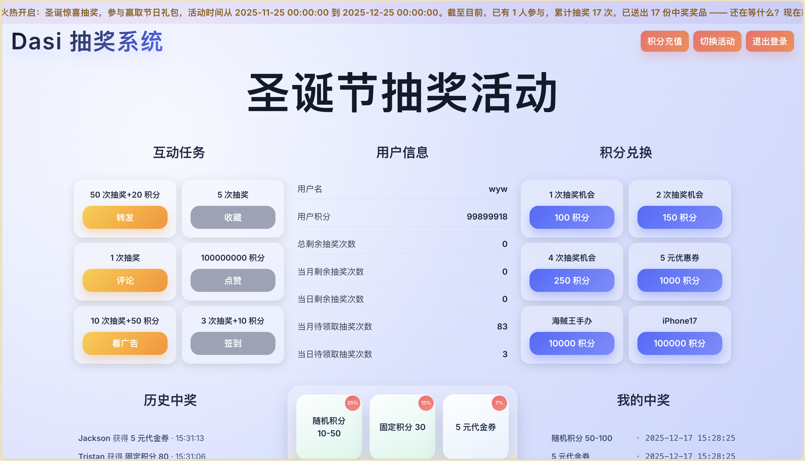
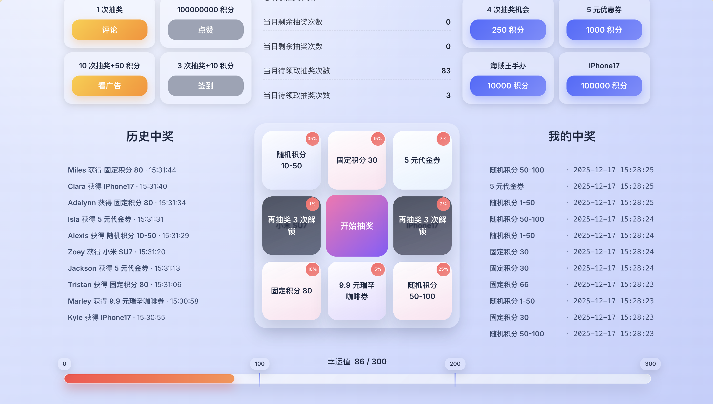
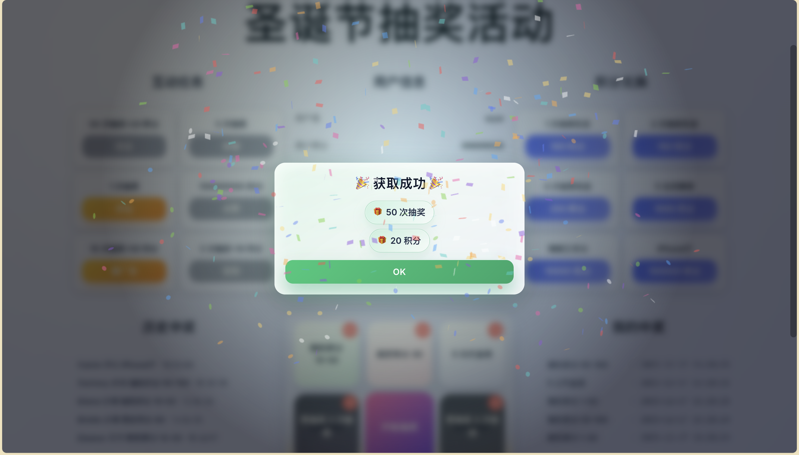
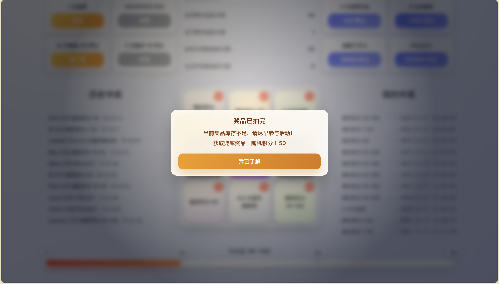
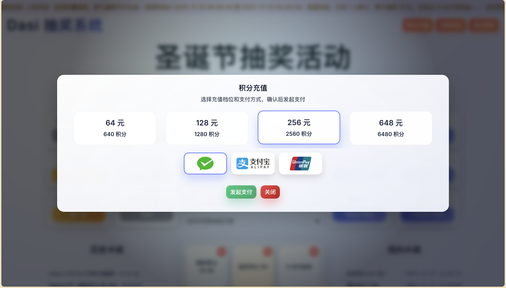
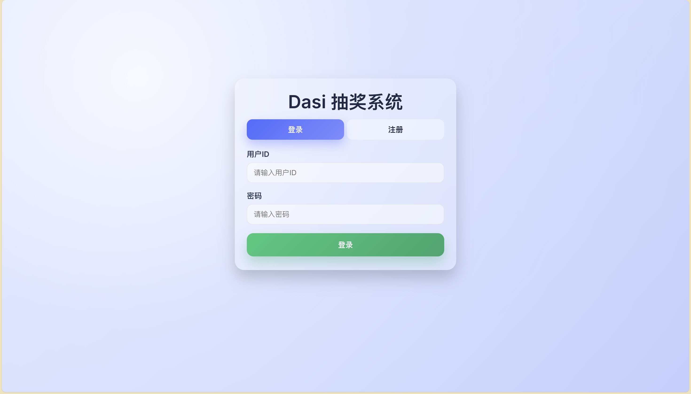
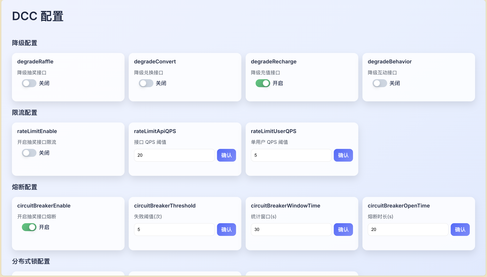

# 幸运抽奖组件

## 项目概述

LuckyDraw 是一个基于 **Spring Boot 2.7** 与 **DDD（领域驱动设计）** 的幸运抽奖组件，面向“活动运营型”抽奖场景，覆盖从【**活动配置 → 抽奖策略 → 积分账户 → 中奖记录 → 奖品发放/订单落库**】的全链路业务闭环。项目内置**配置中心（DCC）**，支持对活动、限流、熔断、降级等关键参数进行**在线热更新**，无需重启即可快速生效，便于运营侧灵活调整活动策略、提升系统可用性与迭代效率。

在业务管理侧，系统对抽奖、兑换、充值等关键流程统一沉淀为**多类型订单与流水数据**，配合完整的日志与错误追踪能力，支持管理员进行活动过程监控、问题定位与数据统计分析；在高并发与高可用层面，结合**分布式锁、消息队列、网关转发**等能力，保障核心链路在峰值流量下依然稳定运行。

技术栈：**Java 8，Spring Boot 2.7.12，MySQL 8.0，MyBatis，RabbitMQ，JWT，ZooKeeper/Curator，Redisson，Nginx，Vue 3，Vite，Axios**

## 核心设计

### DDD 架构
接口层（`api`/`trigger`）聚焦协议适配与鉴权、DTO/VO 转换；应用层（`app`）负责用例编排与事务边界；领域层（`domain`）沉淀活动、账户、策略、奖品、订单、任务等核心模型与规则；基础设施层（`infrastructure`）承接 MySQL/Redis/MQ/Nginx 等技术实现。通过 Repository + Entity/VO/Aggregate 统一表达领域语义，避免“控制器堆业务 + DAO 直连”的贫血模型，提升可测性与迭代空间。

### 责任链模式
抽奖前置校验拆为可插拔的 Handler 链路（活动状态/时间窗口、次数额度、黑名单、幸运值档位等），按顺序执行并支持短路；链路节点可按场景组合（抽奖链、兑换链、充值链），新增校验仅需注册 Handler，降低 if-else 耦合。

### 规则树模式

抽奖结果产出后，用规则树承载“库存不足、未解锁、次数上限、兜底奖品”等决策；节点组合表达复杂策略，可配置扩展且易于单测，把结果处理从流程代码剥离为可演进的决策结构。

### 工厂模式

发奖采用“统一入口 + 多实现路由”：注解标识奖品类型，构造注入自动注册 Handler，积分/实物/券码等发放逻辑解耦。统一入口负责幂等与上下文聚合，具体发放由对应 Handler 处理，满足开闭原则。

### MQ 削峰填谷

主链路先落库订单与任务（Task），再将发奖事件封装为 Event 投递 MQ，消费者异步执行发奖、入账、个人奖品仓库写入，削峰并降低延迟。同时引入**任务补偿机制**，定时轮询 Task 表对未分发/失败任务重试；结合订单状态机与消费幂等，保障网络抖动或失败场景下最终一致性。

### HSET 概率装配

策略装配阶段按最小概率单位扩展并打乱奖品概率，生成 index->awardId 的 Map 存入 Redis HSET；抽奖时随机 index 直接命中，避免实时遍历累加，降低尾延迟。支持按幸运值档位拆分装配，实现分档概率分布。

### Queue 防重防超卖

库存先用 Redis 原子 decr 预扣保证并发一致性，setNx(lockKey)（带过期）保护单次扣减唯一性；然后将入库操作放入 Redisson 延迟队列再入阻塞队列消费，错峰异步回刷 DB，减少瞬时写放大；库存归零触发“库存耗尽事件”投递 MQ，驱动数据库同步与缓存清理，形成“缓存扣减 → 事件落库/修正”的闭环。

### @DCCValue 热更新

自定义 @DCCValue + 监听器，将降级、限流、熔断等开关绑定运行时字段，配置变更在线生效无需重启，用于紧急止损、灰度调参与运维快速响应。

### AOP 限流/熔断

接口层 AOP 统一织入限流与熔断：限流基于 Redis 计数做分布式 QPS/单用户阈值，熔断按时间窗口统计失败进入 Open/Half-Open 状态；与 DCC 开关联动，提供可开关、可调参、可观测的稳定性治理。

### Nginx 负载均衡

Nginx upstream 将请求分发到多实例 Spring Boot，横向扩展与流量分摊；Redis 提供锁、缓存、概率表、库存、限流熔断等分布式能力保障一致性与幂等。JWT 鉴权无 Session，便于压测、扩容与容器化。

## 页面展示

### 活动数据

### 抽奖九宫格

### 互动/兑换成功

### 抽奖结果

### 积分充值

### 登陆注册

### 配置中心

